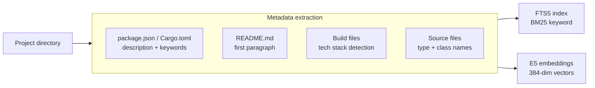
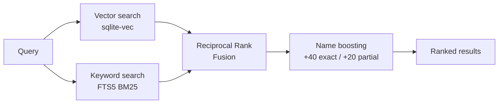

# goto

> Jump to any project instantly — semantic search for your filesystem.

```bash
goto "cache rust"    # → ~/code/foyer
goto api             # → ~/projects/backend-api
goto docs            # → ~/code/documentation
```

No more `cd ~/code/work/team/that-project-i-forgot`. `goto` indexes your projects and understands what they're *about*, not just what they're named.

---

## Install

**One-liner** (no Rust required, macOS only):

```bash
curl -fsSL https://raw.githubusercontent.com/sderosiaux/goto/main/install.sh | bash
```

**Via cargo:**

```bash
cargo install goto-cli
```

Restart your terminal, then:

```bash
goto add ~/code        # tell goto where your projects live
goto update            # index everything (~80MB model download on first run)
goto myproject         # jump!
```

---

## How it works

### Indexing



### Search



---

## Usage

```bash
goto <query>            # jump to best match
goto -a <query>         # show all matches with scores
goto -a -n 30 <query>   # show more results
goto -                  # recently visited projects
goto update             # re-scan and re-index
goto update --force     # re-embed everything
goto add <path>         # add a directory to scan
goto remove <path>      # remove a directory
goto list               # list all indexed projects
goto stats              # access statistics
goto config             # show configuration
goto test               # run ranking tests (~/.config/goto/tests.toml)
```

---

## What gets indexed

| Source | Extracted |
|--------|-----------|
| `package.json`, `Cargo.toml`, `pyproject.toml` | Description, keywords |
| `README.md` | First meaningful paragraph (up to 1500 chars) |
| Build files | Tech stack (40+ frameworks and languages) |
| Directory structure | Semantic folder names |
| Source files (top 10 by size) | Type, class, interface names |

---

## Requirements

- macOS — uses Spotlight (`mdfind`) for project discovery
- First run downloads ~80MB embedding model to `~/Library/Caches/dev.goto.goto/`

---

## License

MIT
