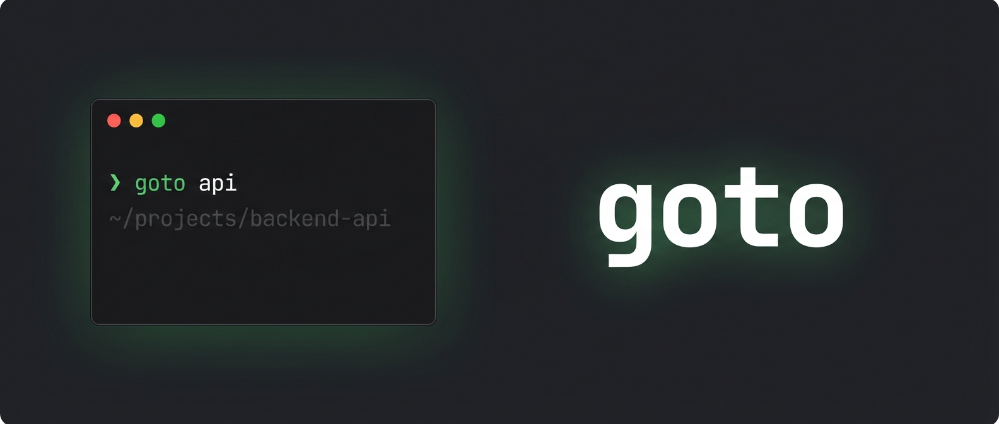

# goto

[](https://crates.io/crates/goto-cli)
[](https://github.com/sderosiaux/goto/actions/workflows/release.yml)
[](LICENSE)
[](#)

> Jump to any project instantly — semantic search for your filesystem.

```bash
goto "cache rust"    # → ~/code/foyer
goto api             # → ~/projects/backend-api
goto docs            # → ~/code/documentation
```

No more `cd ~/code/work/team/that-project-i-forgot`. `goto` indexes your projects and understands what they're *about*, not just what they're named.

---

## Install

**One-liner** (no Rust required):

```bash
curl -fsSL https://raw.githubusercontent.com/sderosiaux/goto/main/install.sh | bash
```

**Via cargo:**

```bash
cargo install goto-cli
```

Restart your terminal, then:

```bash
goto add ~/code        # tell goto where your projects live
goto update            # index everything (~80MB model download on first run)
goto myproject         # jump!
```

---

## How it works

When you run `goto update`, it scans your configured directories and extracts metadata from each project: the description from `package.json` or `Cargo.toml`, the opening paragraph of the README, detected tech stack, directory structure, and type/class names from the largest source files. All of that gets stored in two indexes: a **BM25 full-text index** (FTS5) for keyword matching, and a **384-dim vector index** (sqlite-vec) for semantic similarity using a local `MultilingualE5Small` model (~80MB, runs fully offline).

At search time, both indexes are queried in parallel and their ranked results are merged using **Reciprocal Rank Fusion**. The final scores get a boost if the query matches the project name exactly (+40), partially (+20), or appears in the metadata (+10). The best match above the 55% threshold is returned and you get `cd`'d there automatically.

---

## Usage

```bash
goto <query>            # jump to best match
goto -a <query>         # show all matches with scores
goto -a -n 30 <query>   # show more results
goto -                  # recently visited projects
goto update             # re-scan and re-index
goto update --force     # re-embed everything
goto add <path>         # add a directory to scan
goto remove <path>      # remove a directory
goto list               # list all indexed projects
goto stats              # access statistics
goto config             # show configuration
goto test               # run ranking tests (~/.config/goto/tests.toml)
```

---

## Requirements

- macOS
- First run downloads ~80MB embedding model to `~/Library/Caches/dev.goto.goto/`
- Spotlight (`mdfind`) is optional but recommended for broader project discovery

---

## License

MIT
